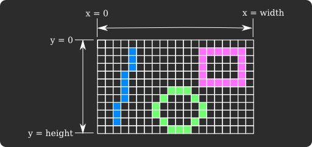

## Welcome to Bitty Engine

[**Manual**](https://paladin-t.github.io/bitty/documents/manual) | [Operations](operations)

**An itty bitty game engine.**

As you see, this document is **draft**. I will gradually fill contents to make it a full description of the libraries, tools and other aspects for game making. For the moment, I suggest you to take a look at the examples for reference, especially the "Libraries" and "Primitives" categories that already covered most API. I'll also improve the examples during this period.

## Table of content

* [Fundamental](#fundamental)
	* [Specifications](#specifications)
	* [Project Structure](#project-structure)
		* [In Directory](#in-directory)
		* [Text Based Archive](#text-based-archive)
		* [Binary Based Archive](#binary-based-archive)
	* [Backup](#backup)
	* [Capturing](#capturing)
		* [Screenshot](#screenshot)
		* [GIF](#gif)
* [Programming](#programming)
	* [Lua](#lua)
		* [Syntax](#syntax)
		* [Standard Libraries](#standard-libraries)
	* [Program Structure](#program-structure)
	* [Libraries](#libraries)
		* [Algorithms](#algorithms)
			* [Pathfinder](#pathfinder)
			* [Randomizer](#randomizer)
			* [Walker](#walker)
		* [Archive](#archive)
		* [Bytes](#bytes)
		* [Data Time](#data-time)
		* [Encoding](#encoding)
			* [Base64](#base64)
		* [File](#file)
		* [Filesystem](#filesystem)
		* [Image](#image)
		* [JSON](#json)
		* [Math](#math)
		* [Network](#network)
		* [Platform](#platform)
		* [Stream](#stream)
	* [Assets and Resources](#assets-and-resources)
		* [Resources](#resources)
		* [Asset](#asset)
		* [Palette Asset](#palette-asset)
		* [Texture Asset](#texture-asset)
		* [Sprite Asset](#sprite-asset)
		* [Map Asset](#map-asset)
		* [SFX Asset](#sfx-asset)
		* [Music Asset](#music-asset)
	* [Primitives](#primitives)
		* [Shapes](#shapes)
		* [Font](#font)
		* [Texture](#texture)
		* [Sprite](#sprite)
		* [Map](#map)
		* [SFX](#sfx)
		* [Music](#music)
		* [Gamepad](#gamepad)
		* [Keyboard](#keyboard)
		* [Mouse](#mouse)
		* [Camera](#camera)
		* [Clip](#clip)
		* [Blend](#Blend)
	* [Application](#application)
		* [Canvas](#canvas)
		* [Project](#project)
		* [Debug](#debug)
* [Import and Export](#import-and-export)
	* [Import](#import)
	* [Export](#export)
* [Building](#building)
	* [Building for Desktop](#building-for-desktop)

[HOME](#welcome-to-bitty-engine)

# Fundamental

## Specifications

* Display: defaults to 480x320 pixels, configurable to bigger, smaller or self-adaption, up to 4800x3200
* Audio: 1 BGM channel, 4 SFX channels; supports MP3, OGG, WAV, FLAC, etc.
* Font: supports Bitmap and TrueType
* Code: Lua, supports multiple source files
* Sprite: up to 1024x1024 pixels per frame, up to 1024 frames per sprite
* Map: up to 4096x4096 tiles per page
* Image: either true-colored (PNG, JPG, BMP, TGA) or paletted, up to 1024x1024 pixels per file
* Palette: 256 colors with transparency support
* Gamepad: 6 buttons for each pad (D-Pad + A/B), up to 2 players
* Keyboard and mouse: supported

## Project Structure

TODO

### In Directory

TODO

### Text Based Archive

TODO

### Binary Based Archive

TODO

## Backup

Bitty Engine makes backup once you save an asset or a project, the entire project will be stored to `X:/Users/YourName/AppData/Roaming/bitty/engine/backup` on Windows.

You can navigate there by clicking "Project", "Browse Data Directory...".

## Capturing

TODO

### Screenshot

TODO

### GIF

TODO

[HOME](#welcome-to-bitty-engine)

# Programming

## Lua

Bitty project is programmable in the [Lua](https://www.lua.org/) programming language.

### Syntax

Lua is widely used and validated in the software industry, there are a lot of learning materials about the language on the internet. Click to see the [official documentation](https://www.lua.org/docs.html).

### Standard Libraries

The ready to use modules, `package`, `coroutine`, `table`, `string`, `math`, `utf8`, are reserved from the original.

The trivial modules, `io`, `os`, `debug`, are disabled. Bitty Engine offers alternatives.

## Program Structure

A conventional entry program of Bitty project is made up of a `setup` function which is called once a program starts, and an `update` which is called periodically:

```lua
function setup()
end

function update(delta)
end
```

Define another `quit` function to run code on execution termination:

```lua
function quit()
end
```

Generally `setup` is used to initial game variables, states, `update` is where gameplay logic goes, and `quit` is for persist necessary data on disk. All the three entries are optional.

## Libraries

TODO

### Algorithms

TODO

#### Pathfinder

This module is used to perform a pathfinding algorithm on 2D grids:

TODO

#### Randomizer

TODO

#### Walker

This module is used to perform a smooth walking algorithm on 2D grids:

TODO

### Archive

TODO

### Bytes

TODO

### Data Time

TODO

### Encoding

TODO

#### Base64

TODO

### File

TODO

### Filesystem

TODO

### Image

TODO

### JSON

TODO

### Math

TODO

### Network

TODO

### Platform

TODO

### Stream

TODO

## Assets and Resources

TODO

### Resources

TODO

### Asset

TODO

### Palette Asset

TODO

### Texture Asset

TODO

### Sprite Asset

TODO

### Map Asset

TODO

### SFX Asset

TODO

### Music Asset

TODO

## Primitives

The coordinate definition in Bitty Engine is:



TODO

### Shapes

TODO

### Font

TODO

### Texture

TODO

### Sprite

TODO

### Map

TODO

### SFX

TODO

### Music

TODO

### Gamepad

TODO

0 for Left, 1 for Right, 2 for Up, 3 for Down, 4 for A, 5 for B.

### Keyboard

TODO

### Mouse

TODO

0 for LMB, 1 for MMB, 2 for RMB.

### Camera

TODO

### Clip

TODO

### Blend

TODO

## Application

TODO

### Canvas

TODO

### Project

TODO

### Debug

TODO

[HOME](#welcome-to-bitty-engine)

# Import and Export

TODO

## Import

TODO

## Export

TODO

[HOME](#welcome-to-bitty-engine)

# Building

TODO

## Building for Desktop

TODO

[HOME](#welcome-to-bitty-engine)
